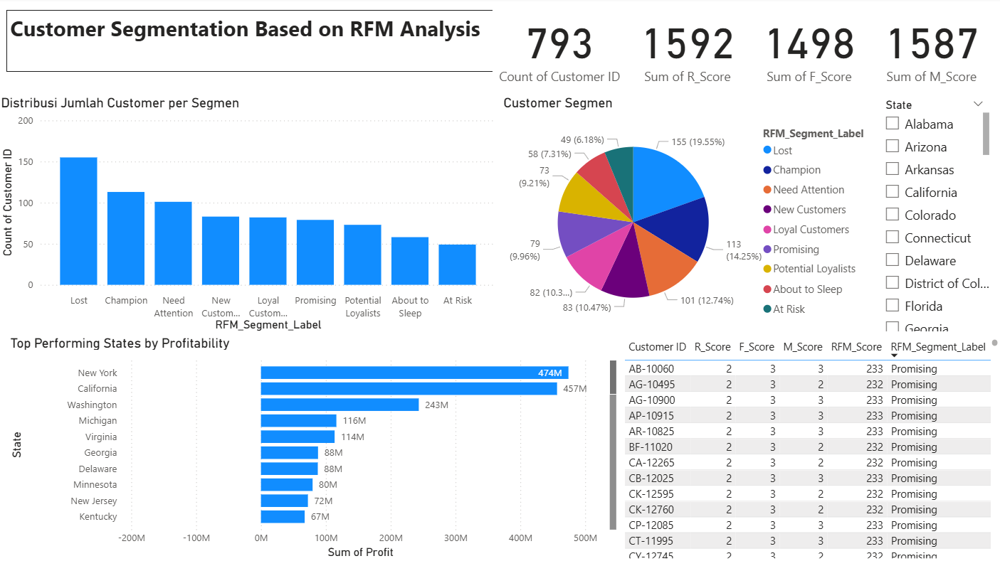
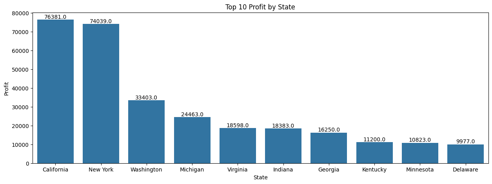
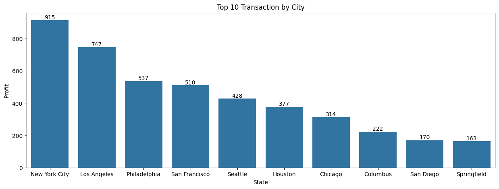
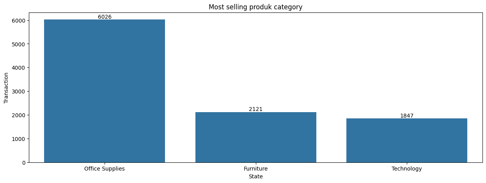
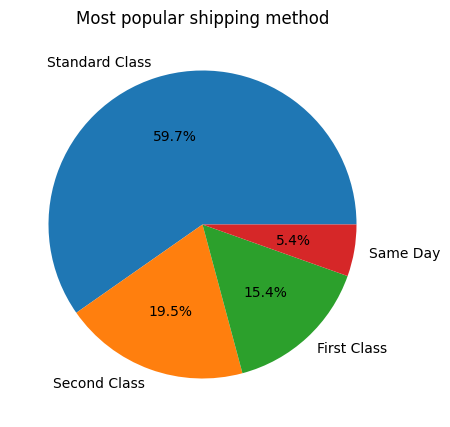
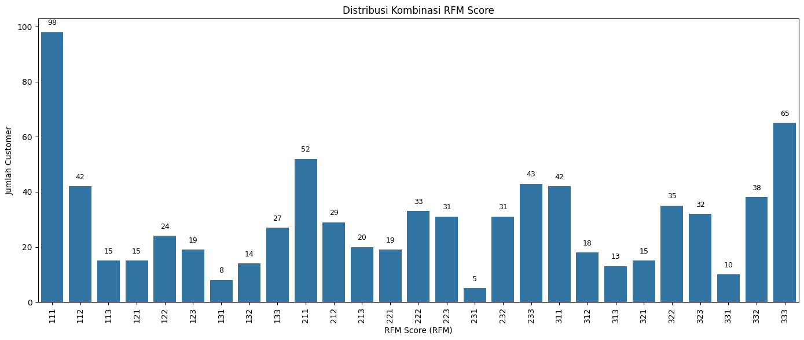
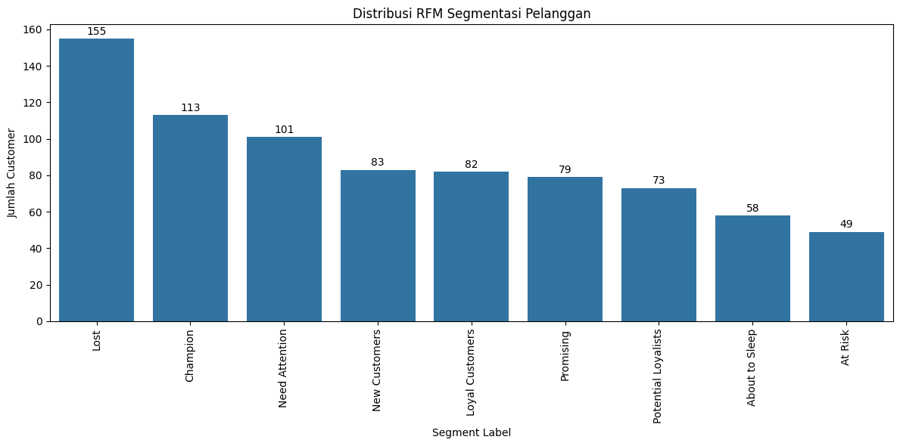

# 📣 Marketing Channel Analysis — RFM Segmentation

# 🎯 Objective
Menganalisis performa channel/market menggunakan segmentasi pelanggan berbasis RFM (Recency, Frequency, Monetary) untuk bahan strategi retensi, akuisisi, dan reaktivasi.# Marketing-Channel-Analysis.

# 🗃️ Dataset
- Sumber: Sample Superstore (transaksi, pelanggan, lokasi).
- Kolom kunci: order_date (Recency), order_id (Frequency), sales (Monetary).
- Kualitas data: missing/duplikat tidak ditemukan; outlier tidak mengganggu.

# 🧩 Metodologi
- Data Cleaning (format tanggal, validasi nilai).
- Hitung R, F, M per customer sampai cut-off date.
- Skoring RFM (kuartil 1–3 atau 1–4) → gabung menjadi RFM Score.
- Mapping segmen (Champion, Loyal, Potential/Loyalists, Lost, Need Attention, dll).
- Analisis channel/market: state/city, category, shipping, dsb.
- Visualisasi (Power BI/Matplotlib) untuk monitoring.

# 🔑 Key Findings (ringkasan)
- Distribusi Segmen: Lost (~19.5%), Champion (~14.25%), Need Attention (~13%), Loyal (~12.74%).
- Profitability (State): New York, California, Washington berada di posisi teratas.
- Top City by Transactions: New York City (~915 transaksi).
- Top Category: Office Supplies.
- Top Shipping Method: Standard Class (~59.7%).
- Skor RFM rata-rata masih sedang → ruang optimasi terbuka.

# 💡 Recommendations
- Pertahankan Champion & Loyal: program eksklusif + feedback loop.
- Reaktivasi Lost & Need Attention: retargeting campaign & promo personal.
- Fokus wilayah profitabel: prioritaskan New York, California, Washington.
- Eksperimen di segmen Promising/Potential Loyalists (A/B testing, offer variants).

# 📊 Visual

Main Dashboard

TOP 10 Profit by State

TOP 10 Transaction by City

Most Selling Product Category

Most Popular Shipping Method

Distribusi Kombinasi RFM Score

Distribusi RFM Segmentasi Pelanggan

